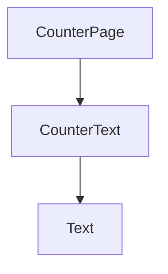
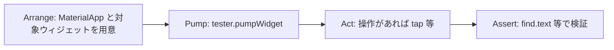

# カウンター画面・CounterText テストケース

## ウィジェット構成



- `CounterPage`（`StatefulWidget`）が `_counter` を保持し、`FloatingActionButton` で加算する。
- `CounterText`（`StatelessWidget`）は `value` を受け取り、`Text` で十進文字列として表示する。

## テスト観点一覧

| テストファイル | ケース名 | 期待結果 |
|----------------|----------|----------|
| `test/presentation/counter/counter_text_test.dart` | `displays 0 when value is 0` | `find.text('0')` が 1 件 |
| `test/presentation/counter/counter_text_test.dart` | `displays 1 when value is 1` | `find.text('1')` が 1 件 |
| `test/presentation/counter/counter_text_test.dart` | `displays multi-digit value` | `find.text('42')` が 1 件 |
| `test/presentation/counter/counter_page_test.dart` | `shows 0 initially` | 初期表示が `0` |
| `test/presentation/counter/counter_page_test.dart` | `increments counter when FAB is tapped` | FAB タップ後に `1` が表示される |

## ウィジェットテストの実行フロー



- `CounterText` のテストでは `Act` は省略（表示のみ検証）。
- `CounterPage` の加算テストでは `FloatingActionButton` を `tap` し、`pump` で再描画してから表示を検証する。

## テストの実行方法

プロジェクトルートで次を実行する。

```bash
flutter test
```
